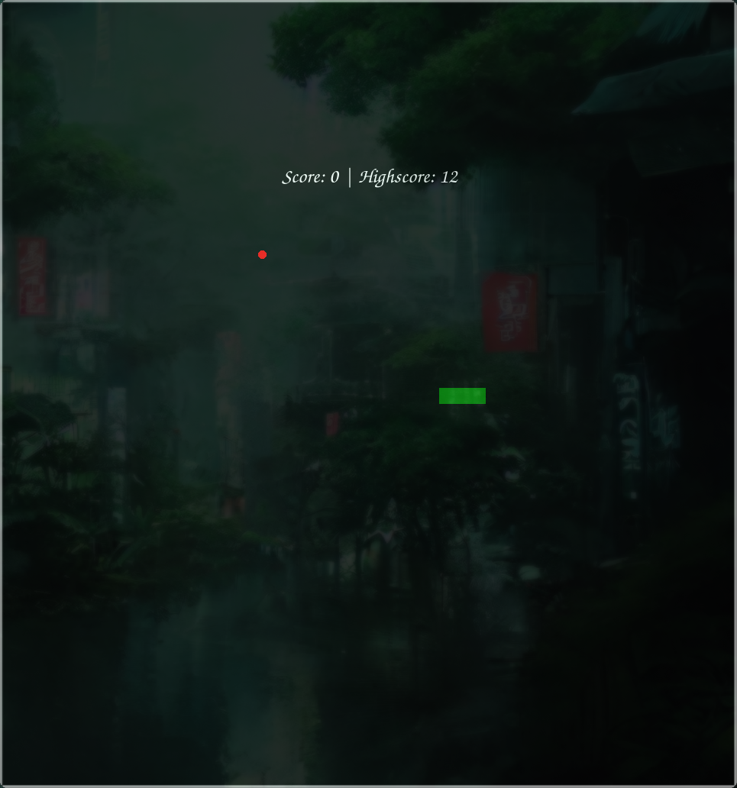

# Snake Game 🐍

A classic Snake game implemented in Python using the Turtle Graphics library. Test your reflexes by guiding the snake to collect food while avoiding collisions with the walls and yourself!

---

## Features ✨
- **Classic Snake Gameplay**: Eat the food and grow longer with each bite.
- **Real-time Scoring**: Track your score as you progress.  
- **Simple Graphics**: Retro-inspired minimalistic visuals using Turtle Graphics.  
- **Responsive Controls**: Use arrow keys for seamless movement.

---

## Screenshot 📸
